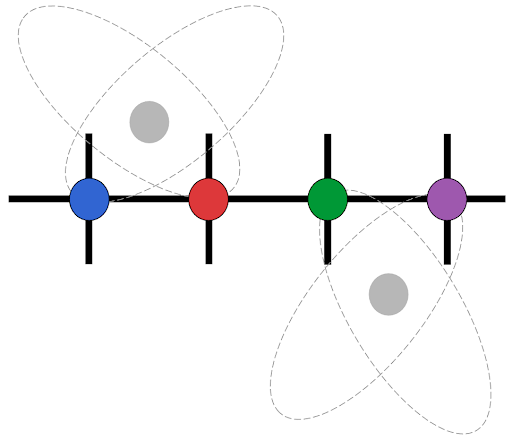

# ChemQHam.jl

<p align="center">
  
</p>

A Julia package for optimal quantum chemistry Hamiltonian construction in matrix product operator (MPO) form.

## Features

- **Chemical Operator Sum Generation**: Convert quantum chemistry integrals to operator sums
- **Minimal Hamiltonian terms**: Takes advantage of the symmetry in the two-electron interaction coefficients
- **Optimized MPO Construction**: Uses bipartite graph theory methods for minimal bond dimension
- **TensorKit Integration**: Convert to TensorKit tensor network format with symmetry support
- **[fZ ⊠ U₁ ⊠ SU₂] Symmetry**: Currently supports U₁ particle number ⊗ SU₂ spin rotation symmetry on top of the fundamental fermionic parity
- **ITensor Compatibility**: Interface with ITensorMPS and ITensorChemistry for testing

## Installation

```bash
julia> using Pkg

julia> Pkg.add(; url="https://github.com/dfelmanl/ChemQHam.jl")
```

## Quick Start Example

```julia
using ChemQHam

# Define the molecule
molecule = Molecule([("Li", 0.00, 0.00, 0.0000), ("H", 0.00, 0.00, 1.000)])

# Calculate molecular Hartree-Fock data  
h1e, h2e, nuc_e, hf_orb_occ_basis, hf_elec_occ, hf_energy = molecular_hf_data(molecule)

# Construct the chemical MPO with [fZ ⊠ U(1) ⊠ SU(2)] symmetry
mpo = chemical_mpo(h1e, h2e, nuc_e)

# Initialize an MPS with Hartree-Fock occupation
mps_hf = init_mps_hf(hf_orb_occ_basis, hf_elec_occ)

# Run DMRG to find the ground state
mps_ground = dmrg(mps_hf, mpo)
```

## Citation

If you use ChemQHam.jl in your research, please cite it as:

```bibtex
@software{ChemQHam.jl,
  author = {Daniel Felman},
  title = {ChemQHam.jl: Optimal Quantum Chemistry Hamiltonian Construction in MPO Form},
  url = {https://github.com/dfelmanl/ChemQHam.jl},
  year = {2025}
}
```

## Acknowledgments
- **[Dr. Philipp Schmoll](https://github.com/philihps)** — for invaluable discussions and design insights throughout the development of this package.

- **[Prof. Yaron Oz](https://english.tau.ac.il/profile/yaronoz)** and the Tel Aviv University — for the trust and financial support during this project.

- This package uses ideas from the **bipartite graph theory** algorithm described in [arXiv:2006.02056](https://arxiv.org/pdf/2006.02056) and implemented in the [Renormalizer](https://shuaigroup.github.io/Renormalizer/) project.

## License

This project is licensed under the MIT License - see the [LICENSE](LICENSE) file for details.
